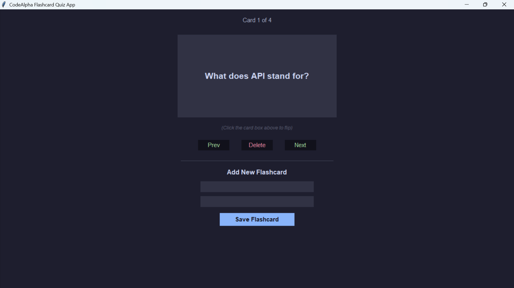

# 🗂️ Flashcard Quiz Application

A modern, responsive desktop Flashcard Quiz Application built using Python and the native Tkinter GUI framework. This project was developed as part of the **CodeAlpha Software Development Internship** (Task 1) to provide an interactive interface for active recall study sessions.

---

## 🚀 Features

- **Interactive Card Flipping:** Click directly on any flashcard box to instantly reveal or hide the answer with clean visual state shifts.
- **Seamless Navigation:** Easily traverse through the card deck using intuitive `Prev` and `Next` tracking buttons.
- **Dynamic Content Management:** Add custom questions and answers instantly through the integrated input form.
- **Smart Queue Deletion:** Remove mastered cards dynamically with real-time progress tracker updates (`Card X of Y`).
- **Modern Dark UI:** Tailored with a custom, high-contrast dark aesthetic built for prolonged studying comfort.

---
## 📸 Application Preview

Below is a snapshot of the fully functional application layout in action:

<p align="center">
  
</p>

## 🛠️ Built With

- **Language:** Python 3.x
- **GUI Framework:** Tkinter (Native Standard Library)
- **Component Styling:** Custom hexadecimal-mapped component states

---

## ⚙️ Setup and Installation

Since this application utilizes Python's built-in standard graphics library, **no external third-party dependencies or installations are required.**

1. **Clone the Repository:**
   ```bash
   git clone [https://github.com/AmnaShaban/CodeAlpha_FlashcardQuizApp.git](https://github.com/AmnaShaban/CodeAlpha_FlashcardQuizApp.git)
   cd CodeAlpha_FlashcardQuizApp
Run the Application:
Execute the standard execution script directly from your terminal or command prompt:

Bash
python flashcard.py

---

markdown
## 📌 Internship Task Requirements Checklist

- [x] Create a user-friendly interface for flashcard interaction.
- [x] Implement 'Next' and 'Previous' card tracking mechanics.
- [x] Toggle-flip feature to show/hide card answers.
- [x] Dynamic add and delete customization controls.


 
